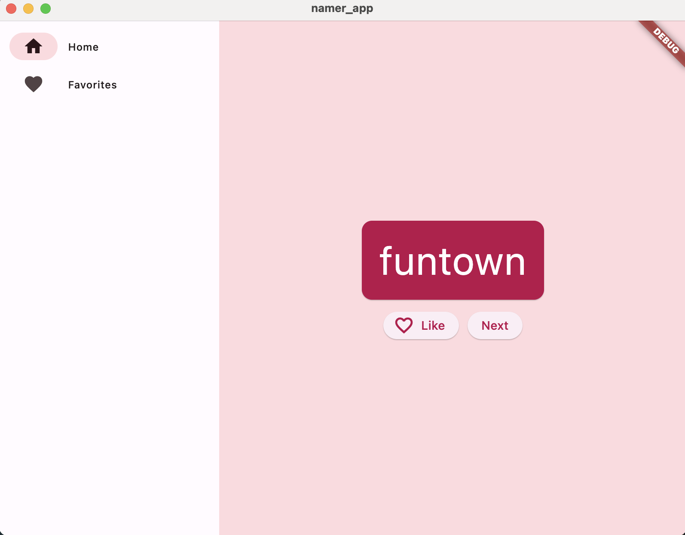

# Flutter_Word_Combinator

Hi, everyone! This is my first Flutter project.\
Flutter Word Combinator is a simple, fun application built with Flutter that randomly generates unique combinations of two English words. Users can either like the combined word and add it to their favorites list or skip to the next random combination.

Let's see what can we do next with Flutter!!

## Features

- Generate random combinations of two English words
- Like or dislike the generated word combinations
- View and manage the list of favorite word combinations

## Getting Started

### Prerequisites

- Flutter SDK
- Visual Studio Code (with the Flutter and Dart plugins)
- Xcode
This project is a starting point for a Flutter application.

### Installation
1. Clone the repository: 
2. Navigate to the project directory: `cd flutter_word_combinator`
3. Install the required dependencies: `flutter pub get`
4. Open the project in Visual Studio Code.
5. Run the app on an emulator or physical device by clicking the "Run" button or executing the `flutter run` command in the terminal.

## Technologies Used

- Flutter
- Dart

## License

This project is licensed under the MIT License. See the [LICENSE](LICENSE) file for details.

